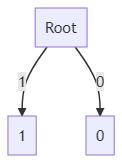
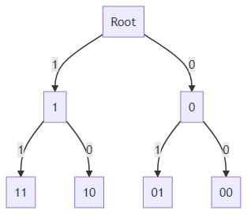
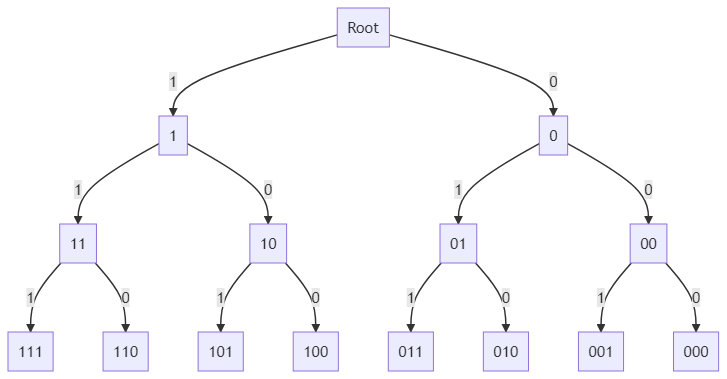
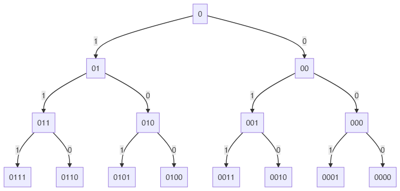
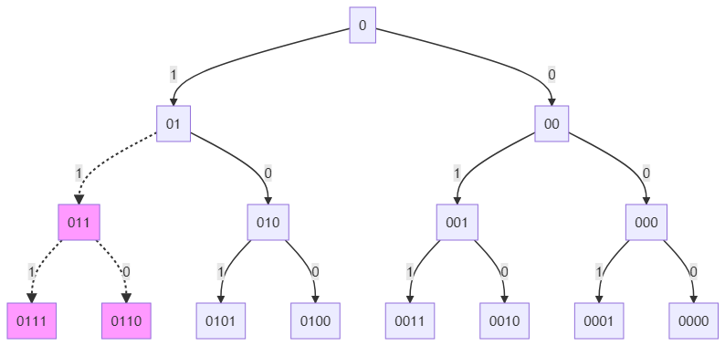
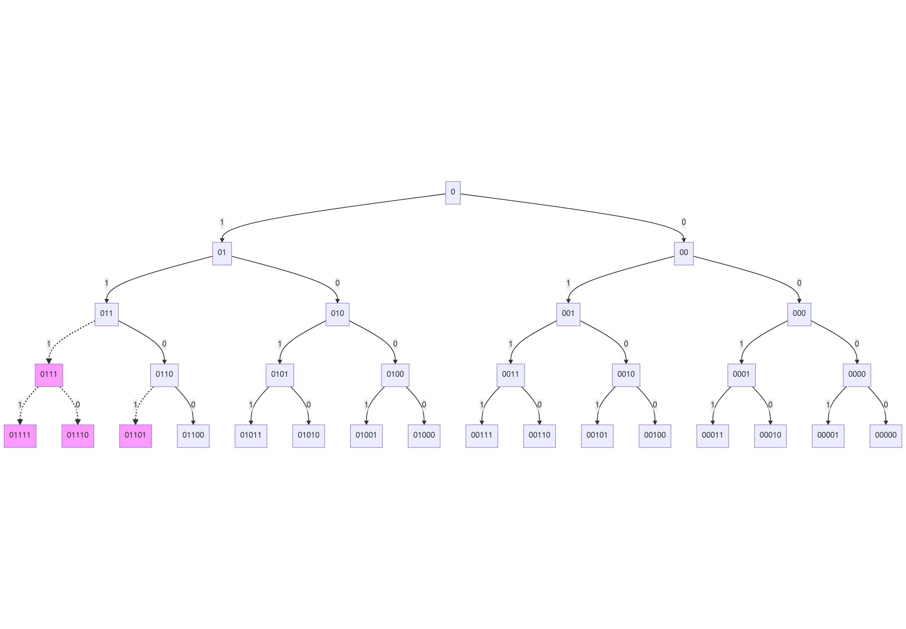
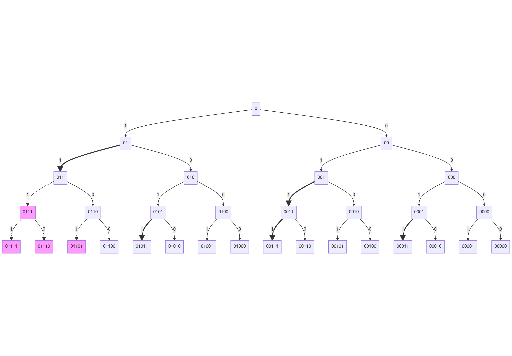
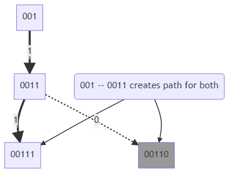
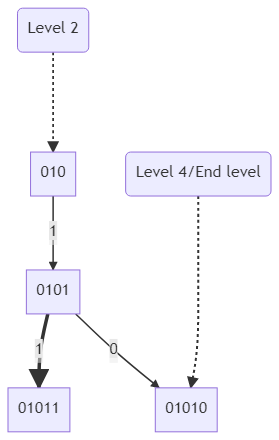

Tags: Digit DP<br>
Outline: We can solve this problem by constructing a tree of all the valid combinations and then use dynamic programming to calculate the number of total adjacent bits.

Before solving the problem directly, let's solve two small sub problems first.<br>

Say, we are given a fixed integer 3 and asked to construct a tree that represents a step by step procedure to find all the numbers having at most 3 digits in their binary equivalent.<br>
How? Pretty straight forward right? Starting with a "Root" node we will just add up either 0 or 1 in each step until we reach 3 numbers of digits. Something in this way-<br>
Step 1:<br>
<br>
Step 2:<br>
<br>
And finally:<br>
<br>
This is how we can find all the combinations for a number with at most 2 digits in it's binary eqivalent.<br>
But, we can make a little change here. Instead of regarding the "Root" node as a completely differnt type of node, we can regard this as "0" and add a "0" infront of all other nodes. Thus we can still have all the combinations with at most 3 digits(XXX) or more precisely with 4 digits having a leading "0"(0XXX). This small change will help us during implementation.<br>
<br>
We can find the binary equivalent of numbers - 7, 6, 5, 4, 3, 2, 1, 0 as the final leaves of the tree.<br>

Now, let's make our subproblem a bit tough. What if instead of maximum number of digits, we are given an integer N and asked to construct a similar kind of tree with numbers less than or equal to N. Say we are given N = 5. Binary equivalent of 5 is 0101 which is clearly consists of 3 digits (4 with a leading "0"). So our resultant tree will be quite alike except number 6 and 7 will not be there in our answer. So our final result will be all of the previous leaves except 0111(7) and 0110(6).
<br>
So, how can we solve this problem?<br>
We can see for given integer 5(0101), our path started to vary from node 011. Why? As the first 3 digits of the given integer is 010, so, 011 is more than 010. If we proceed any further with this node 011, it will always be resulting in a bigger number than the given one. So we can't and stop this path here. If we look closely, we can see this is the first place (after the leading "0" of course) of the given number 5(0101) where there is "0"! So, out of many paths to reach a leaf of the tree, if we go through the "exact same path" of the given integer, whenever we reach a "0", we will not take "1" for that place. Otherwise we would take both "1" and "0". <br>
So, when we iterate over the tree, we have to keep track of whether we are at the exact same path or not.<br>
Another example for N = 12 (01100), will clearify this point more.<br>
<br>

Now we are ready to solve our main problem- we need to calculate total number of adjacent bits i.e every two consecutive "1"s from 0 to N.<br>
When while building the tree, we can say an adjacent bit occurs only when we take a "1" for a node that ends with "1"(say 1-1 edge). For example for N = 12, the (1-1) edges are the adjacent bits.
<br>
So we can see here, for N = 12, there are 5 (1-1)edges. But for N = 12 there are in total 6 adjacent bits-
|Number | Binary representation | Number of adjacent bits|
|-------|-----------------------|------------------------|
|   3   |       0011            | 1                      |
|   6   |       0110            | 1                      |
|   7   |       0111            | 2                      |
|   11  |       01011           | 1                      |
|   12  |       01100           | 1                      |
| Total |        ---            | 6                      |

Clearly, only counting the (1-1)edges will not yeild our final ans. Then what should be?<br>
After node "01" we are counting one bold (1-1)edge for one addition of "1". But see, addition of one "1" to "01" creats "011" which is the pathway of two numbers "0111"(7) and "0110"(6).which means, by taking account of only the (1-1)edges, we are not counting "0110" but only "0111". And that's why our ans didn't match.<br>
<br>
So, now we can come to a conclusion, for each node we need count all the valid lowest descendants (or the leaves) and for each (1-1)edge we will just add the total number of valid lowest descendants with the answer and thus our ultimate ans will be generated.<br>

But what would be the time complexity? As N can be 2^31 i.e. greater than 10^9. So time complexity would be O(10^9) and sadly, all this tree build up will help us nothing! So, again what to do?<br>
There comes the dynamic programming!<br>
Let's analysis the tree for one last time and we can find this similarity (taking node 010 and 000 for N = 12)- <br>
 <br>
So, either total number of lowest descendants or total number of adjacent bits are not dependant on particularly on the nodes but on the level of the node and parity of the node (either "1" or "0"). And also as we discussed above, if it is the exact same path of the given integer N, then there will be some lowest descendants which can become invalid.<br>
And thus we can declear, the three states of DP- 1. Level of the node(can be at best form 0 to 31) 2. Parity of the node(either 1 or 0) 3. Is it in the exact same path as the given integer N?(1 for exact same path and 0 for other paths)<br>
Let, dp[level][parity][path] is for calculating total number of adjacent bits upto that state and tot[level][parity][path] for keeping account of how many valid lowest descendants are there for that state. And with this we can compute the result recursively initializing it with the state of the root (level = 0, parity = 0, path = 1) as 0 is the exact path for the given integer N. And our transition state can be defined by-
dp[level][parity][path] = dp[level+1][1][path] + dp[level+1][0][path].
and if(parity == 1) dp[level][parity][path] += tot[level+1][1][path]
And also we need to take special care for path = 1.

Just by using this dp approach time complexity comes down to O(log N).

Code in C++:
```C++
#include <vector>
#include <set>
#include <queue>
#include <cstring>
#include <complex>
#include <unordered_set>
#include <list>
#include <chrono>
#include <random>
#include <iostream>
#include <algorithm>
#include <cmath>
#include <string>
#include <map>
#include <unordered_map>
#include <stack>
#include <iomanip>
#include <fstream>
using namespace std;
typedef long long ll;
typedef long double ld;
ll num_of_digits, binary_eq[35], dp[35][2][2], tot[35][2][2];

ll compute(ll level, ll parity, ll path){
    if(level == num_of_digits){            //Check if we have reached the end of a valid combination
        tot[level][parity][path] = 1;    //Add this 1 combination to the total number of combinations
        return 0;
    }
    ll u = 0, v = 0;
    if(path == 1){              //Check if we are currently on the exact same path as the binary equivalent
        ll next_digit = num_of_digits - 1 - level;
        if(binary_eq[next_digit] == 1){         //Check if the next digit of the binary representation is 1
            u = compute(level+1, 1, 1) + compute(level+1, 0, 0); //Add both "0" and "1" edge but when "0" is added,
            v = tot[level+1][1][1] + tot[level+1][0][0];        //it is no longer the exact same path, so path = 0
            if(parity == 1) u += tot[level+1][1][1];      //Adjacent bit is found
        }else{
            u = compute(level+1, 0, 1); //Add only "0" edge as adding "1" will make the number greater than N
            v = tot[level+1][0][1];
        }
    }else{
        u = compute(level+1, 0, 0) + compute(level+1, 1, 0); //As the path is "0" already, no matter what the parity is
        v = tot[level+1][0][0] + tot[level+1][1][0];
        if(parity == 1) u += tot[level+1][1][0];         //Adjacent bit is found
    }
    return u;
}

void convert_to_binary(ll x){ //Calculating the binary equivalent binary_eq
    ll pos = 0;
    while(x > 0){
        binary_eq[pos] = x % 2;
        x /= 2;
        pos++;
    }
    num_of_digits = pos;
}

int main()
{
    ll t,no=1;
    scanf("%lld", &t);
    while(t--)
    {
        ll n;
        scanf("%lld", &n);
        memset(binary_eq, 0, sizeof binary_eq);
        convert_to_binary(n);
        memset(dp, -1, sizeof dp);
        memset(tot, 0, sizeof tot);
        ll ans = compute(0, 0, 1);           //Initialize recursion with level = 0, parity = 0, path = 1
        printf("Case %lld: %lld\n", no++, ans);
    }
    return 0;
}
```
